# C# Development in Code Spaces

## Required
- Free Github Account
- www.github.com
    - Sign up with your student email
    - Sign up for free student perks afterwards
        - https://education.github.com/pack

## Step 1 - Create a new GitHub Repository

### **1. Login to [GitHub](www.github.com)**

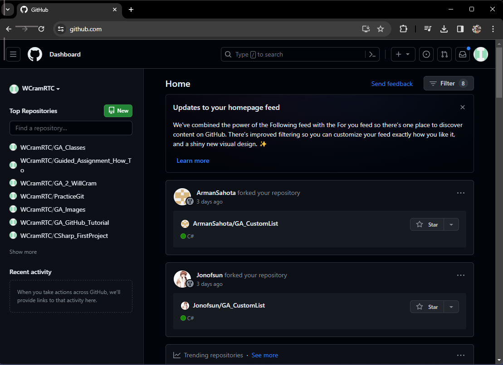

### **2. Click on the green `new` button.**

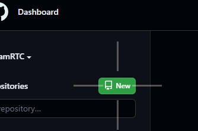

### **3. Setup your new repository**

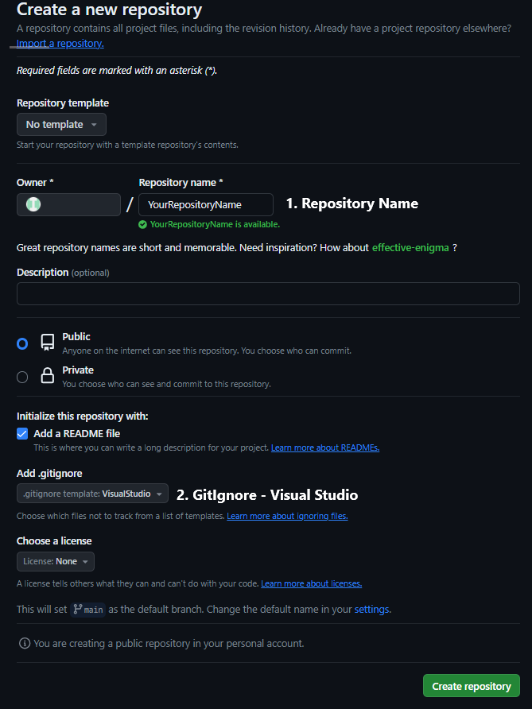

- 1. Give your repository a name. This will be the name of your project.
- 2. Click the dropdown and make sure you choose **`VisualStudio`** from the options.

### **4. Click Create Repository**

Your new repository

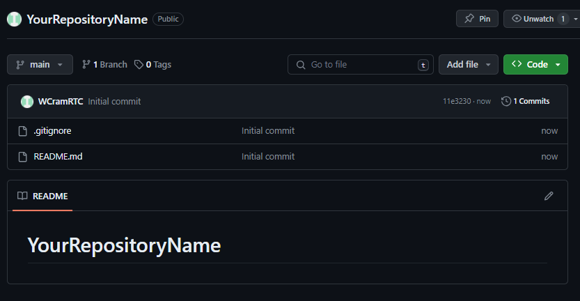

---

## Step 2 - Open a Codespace from your Repository

### 1. Click on the green **`Code`** button.
### 2. Select the **`Codespaces`** tab.
### 3. Click **`Create codespace on main`**
    - Or select a Codespace you've previously made

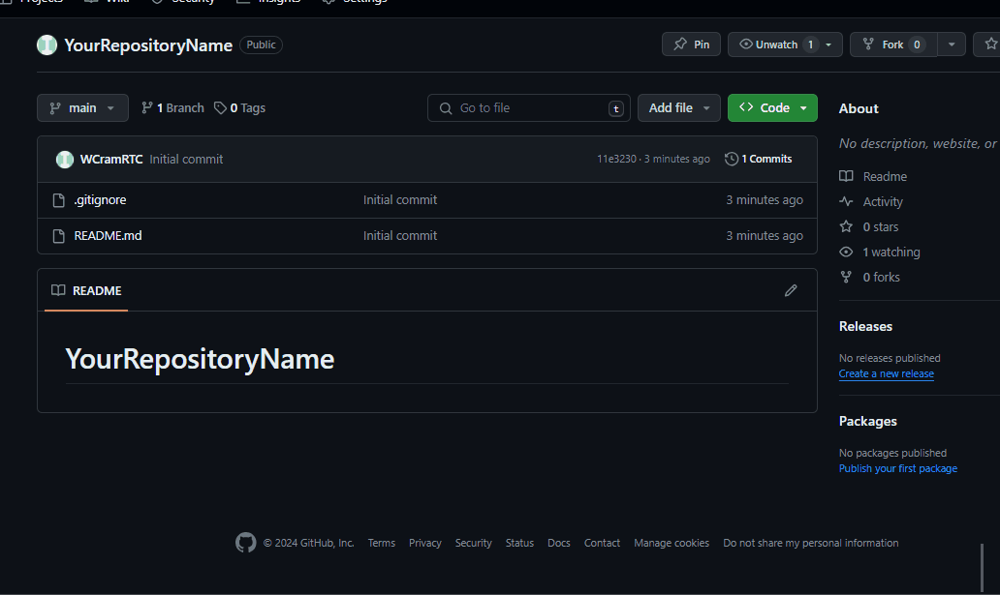

### Result

Your new Codespace will open in a new browser. You are now set to get your project setup.

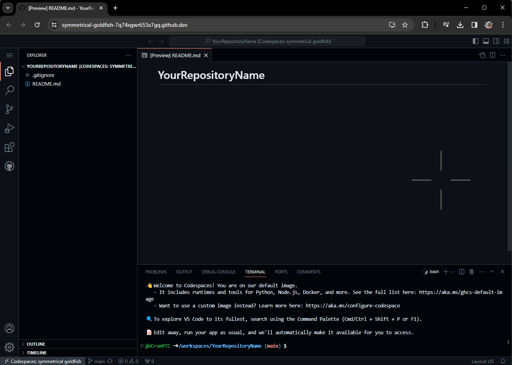

---

## Step 3 - Create a new Console App

### 1. Click on the terminal window at the bottom of the screen.
### 2. Type in the following code: 
    `dotnet new console --use-program-main` and hit enter.

    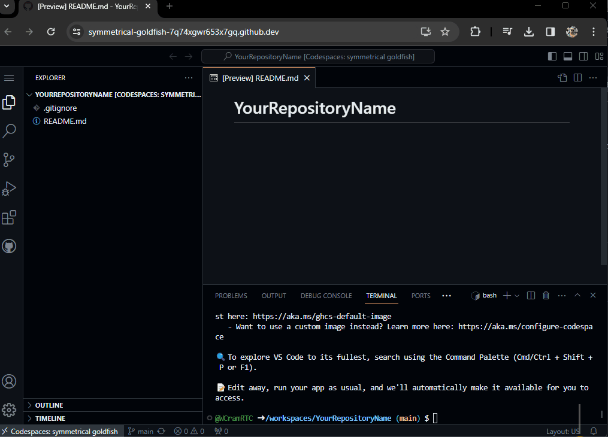

### 3. Your first time, a small popup will appear asking if you want to install the `C# Dev Kit`, click install. It may take a minute.

    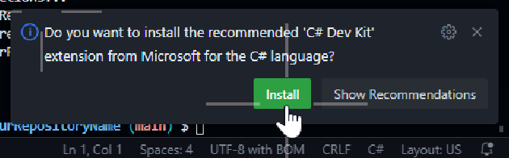

### 4. You can now click on the little paper icon in the upper left corner of the screen. This is our files. Click on the `Program.cs` file.

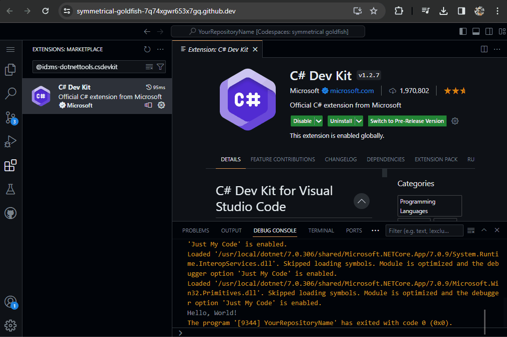

---

## Step 4 - Running Your Code

### 1. Once everything is installed, there should be a small arrow in the upper right corner of the screen. Click it.

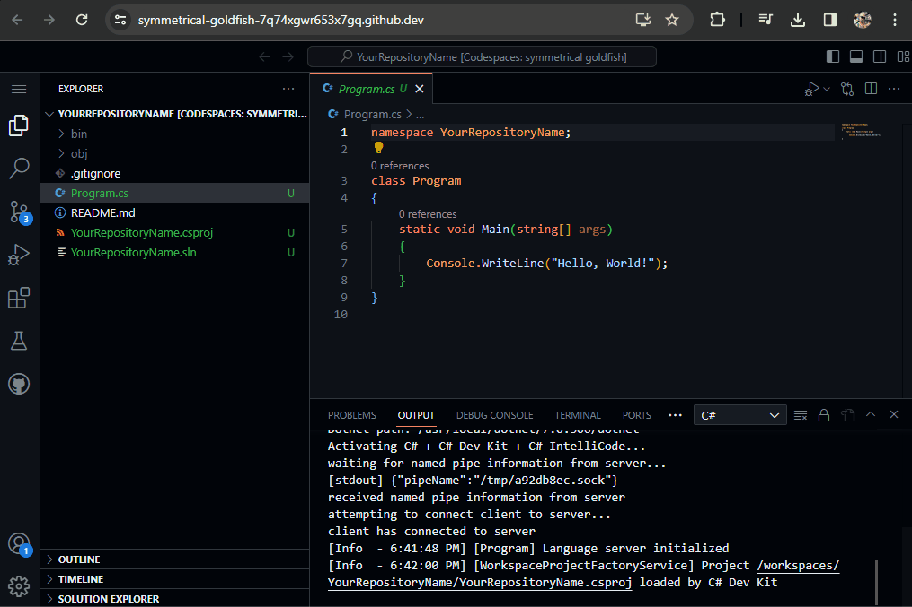

---

## Step 4 - Saving to GitHub

Creating a project in CodeSpaces allows you to save your files directly to GitHub, think of it a little by like the cloud.

### 1. As you make changes to your project, you will see a little number appear on the 3rd icon down on the left.

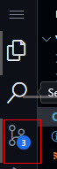

### 2. Click this button and a new menu will appear.

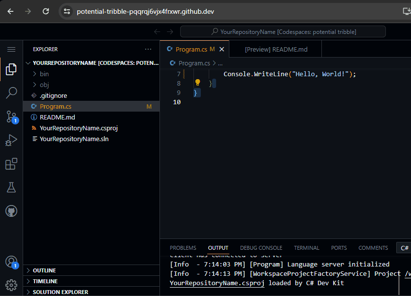

### 3. For your first save, type the phrase `Initial Commit` into the message box.
### 4. Click the arrow to the right in the green `Commit All` box.
### 5. Select `Commit & Push`.
### 6. The first time you do this on a project a message box will appear asking if you would like to `stage all your changes and commit them directly` click **`Always`**.
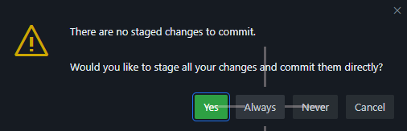

### 7. One more little popup will appear in the corner. Click `Yes`.

### Result

If you go back to your GitHub account and look at your repository, you should now see your files listed.

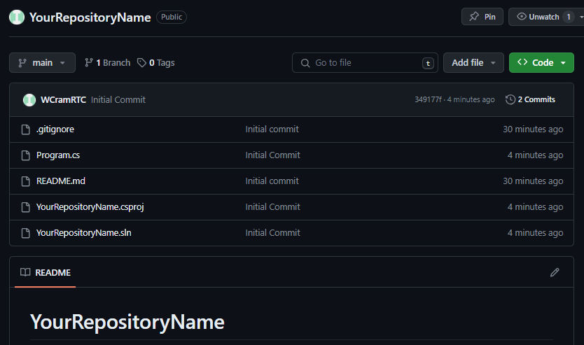

---

